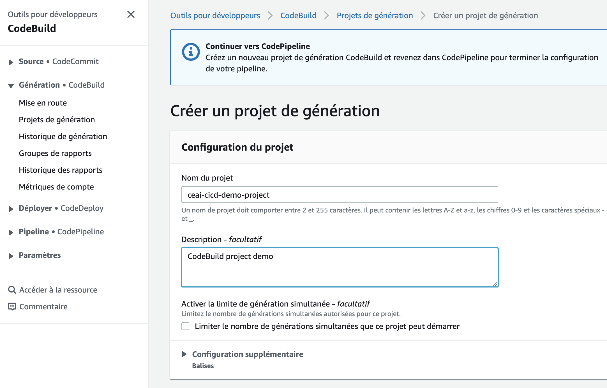

<!-- ENTETE -->
[](https://www.quebec.ca/gouv/politiques-orientations/vitrine-numeriqc/accompagnement-des-organismes-publics/demarche-conception-services-numeriques)
[](https://github.com/CQEN-QDCE/.github/blob/main/LICENCE.md)

---

<div>
    
</div>
<!-- FIN ENTETE -->

Cette démonstration montre comment vous pouvez créer un pipeline CI/CD en utilisant le flux de travail d'un type de projet de [production](https://github.com/CQEN-QDCE/ceai-cqen-documentation/blob/main/Guides/CICD/ceai_cicd_workflow.md#production).

En plus cette démonstration est couper en deux une partie sur GitHub Action et une autre sur AWS Code Pipeline

## Prérequis

- Avoir un compte GitHub configuré avec double facteur d'authentification;

- [Avoir configuré le GitGuardian](https://github.com/CQEN-QDCE/ceai-cqen-documentation/tree/main/Guides/Github)

- Avoir accès à un compte AWS;

- Avoir créé un Bucket S3 qui est exposé avec AWS CloudFront.( [Voir le déploiement de la page d'accueil du CEAI](https://github.com/CQEN-QDCE/ceai-cqen-deployments/tree/main/plateform_web) )


## Démarches 

### GitHub Action

le flux de travail doit être créée dans un dossier .github/workflow/ pour qu'elle soit accessible par GitHub.

Pour créer la structure du dossier, exécutez la commande suivante à la racine du répertoire de votre projet

```
mkdir .github/workflows/
```

Ensuite, Nous allons céréé nos fichiers de flux de travail dans le dossier des flux de travail, ce fichier doit être un fichier yml/yaml.

Cela créera un fichier appelé ci.yml à l'intérieur de votre dossier workflows, le nom de ce fichier est à vous, vous pouvez donner à ce fichier n'importe quel nom mais assurez-vous qu'il se termine par .yml/.yaml.

Ouvrez le fichier ci.yml et collez l'extrait de code ci-dessous

```yml
name: Node.js CI task for develop branch

on:
  push:
    branches: [ develop ]
  pull_request:
    branches: [ develop ]

jobs:
  build_app:
    runs-on: ubuntu-latest
    steps:
    - uses: actions/checkout@v3
    - name: Use Node.js 16.x
      uses: actions/setup-node@v3
      with:
        node-version: 16.x
    - run: echo "Installing mocha JavaScript test framework for Node.js"
    - run: npm i -g mocha
    - run: echo "Installing dependencies"
    - run: npm install
    - run: echo "Installing unit testing framework"
    - run: npm install unit.js
    - run: echo "Cleaning install of your dependencies"
    - run: npm ci
    - run: echo "Building your package"
    - run: npm run build --if-present
    - run: echo "Testing your app"
    - run: mocha test.js
```

## Visualisation des résultats de votre flux de travail

Sur GitHub.com, accédez à la page principale du votre dépot.

Sous le nom de votre dépot, cliquez sur Actions.


Dans la barre latérale gauche, cliquez sur le flux de travail que vous voulez voir.


Dans la liste des exécutions de flux de travail, cliquez sur le nom de l'exécution que vous voulez voir.


Sous Jobs , cliquez sur le job Explore-GitHub-Actions.


Le log vous montre comment chacune des étapes a été traitée. Développez l'une des étapes pour afficher ses détails.


### AWS Pipeline

Ajoutez un nouveau fichier appelé ci-pre-prod.yml au répertoire .aws-pipeline/workflows de votre projet

```
mkdir .aws-pipeline/workflows
```

et créer le fichier ci-pre-prod.yml

```
touch ci-pre-prod.yml
```
Utilisez le code ci-dessous comme base de votre workflow:

```yml
version: 0.2

phases:
  install:
    runtime-versions:
      nodejs: 16  
    commands:
      - echo Installing mocha JavaScript test framework for Node.js
      - npm install -g mocha
  pre_build:
    commands:
      - echo Installing source NPM dependencies...
      - npm install
      - npm install unit.js
      - npm ci
  build:
    commands:
      - echo Build started on `date`
      - echo Testing your app ...
      - mocha test.js
  post_build:
    commands:
      - echo Build completed on `date`
artifacts:
  files:
    - index.html
```

Connectez-vous à la console CodePipeline.

#### Étape 1:

- Donnez au pipeline un nom significatif : ceai-cicd-demo-pipeline
- Sélectionnez Nouveau rôle de service. Donnez-lui un nom significatif : ceai-cicd-demo-pipeline-role
- Magasin d'artefact : Choisissez l'option Default location
- Bucket : sélectionnez le s3 bucket dans lequel le site web statique est hébergé.
- Cliquez sur le bouton Suivant


#### Étape 2 : Création d'une étape source

- Sélectionnez le fournisseur de la source : GitHub - Version 2 (recommandé).
 


- Cliquez sur le bouton Connecter à GitHub. Authentifiez-vous Autorisez AWS CodePipeline à accéder à vos référentiels Github.
- Après l'authentification, sélectionnez le dépôt GitHub contenant les fichiers statiques de votre site Web. 
- Sélectionnez la branche du dépôt; dans notre cas, il s'agit de la pré-prod et de la prod.


Pour stocker les artefacts de sortie de l'action GitHub à l'aide de la méthode par défaut, choisissezCodePipeline par. L'action accède aux fichiers du référentiel GitHub et stocke les artefacts dans un fichier ZIP dans le magasin d'artefacts du pipeline.


#### Étape 3 : Création d'une étape de génération

- Sélectionnez le fournisseur de la génération : AWS CodeBuild.


- Sélectionnez la région: Canada (Central)

Dans Nom du projet, choisissez votre projet de génération. Si vous avez déjà créé un projet de génération dans CodeBuild, choisissez-le. Ou vous pouvez créer un projet de génération dans CodeBuild, puis revenir à cette tâche. Suivez les instructions de la sectionCréation d'un pipeline utilisant CodeBuilddans leGuide de l'utilisateur CodeBuild.

- Cliquez sur créer un projet 



- Ensuite, nous ferons les sélections suivantes :

Image d'environnement - Image gérée

Système d'exploitation - Ubuntu

Runtime(s) - Standard

Image - aws/codebuild/standard:6.0

Version de l'image - "Toujours utiliser la dernière image pour cette cersion d'execution".

Type d'environnement - Linux

Spécifications de la génération - Utiliser un fichier buildspec

Sélectionnez Nouveau rôle de service. Donnez-lui un nom significatif : ceai-cicd-demo-build-role


Nom du fichier buildspec - .aws-pipeline/workflows/ci-pre-prod.yml


- Cliquez sur le bouton Suivant.


4. étape 4

- Déployer le fournisseur : Sélectionnez Amazon S3


- Bucket : Sélectionnez le Bucket qui a été configuré pour le site web statique.
- Extraire le fichier avant le déploiement : Vous devez cocher cette case car le pipeline de code compresse l'artefact.
- Aucune configuration supplémentaire n'est nécessaire. Cliquez sur le bouton Suivant.


Vous pouvez revenir en arrière et modifier la configuration si vous avez fait une erreur à l'étape de révision. Cliquez sur le bouton Créer le pipeline.

Si votre pipeline a été créé avec succès, vous recevrez trois coches vertes sur Source, Build et Deploy.


Allez sur votre domaine à partir du navigateur web.


Et voilà, il est maintenant déployé.